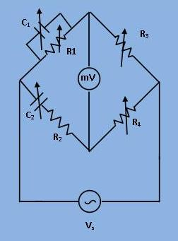

## Procedure

***Fig. 1. Circuit digram of experimental set-up for frequency measurement by Wien Robinsons Bridge.***

#1 Connect the bridge as per diagram.
Keep

$$ R_4 = 2 * R_3 (say R_3=1000 \\omega) $$

Set the dial of the signal generator to read 500 Hz. Apply the signal generator voltage to the bridge.
Keep

$$ C_1 = C_2 = 0.1 \\mu F $$

and adjust resistance R4 and R3
together such that they always read the same value and at balance note the component values and calculate the frequency by 
                
$$ F_c = \frac{1}{2 \pi RC} where\ $$

$$ R = R_1 = R_2 and\ $$

$$ C = C_1 = C_2\ $$

The percentage error between stimulated bridge frequency (Fd) and the (voltage) source frequency (Fs) is calculated
                with respect to Fd as

$$ \\%Error = \frac {(F_d - F_c) * 100} {F_d} $$

where Fd is also called the dial frequency. Repeat procedure for various dial frequencies.

#2 Set the values of the components to give balance of a setting of 1000 Hz. Note the reading of the detector for different dial frequencies on either side in small steps, keeping the output amplitude of the signal generator constant. Draw
                a graph showing the relation between the unbalanced voltage vs. dial frequency.
 

