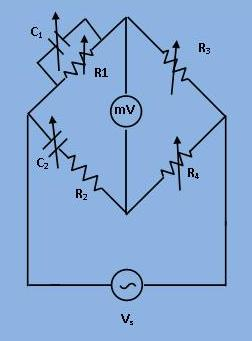

# Introduction

To Study Wien Robinson's frequency Bridge. 

## Theory

#1 To calibrate the dial makring of signal generator by employing the Wien Robinson's bridge.

#2 To determine the response of the bridge with frequency varitation, when the bridge is set for 1000 Hz.

   
 Circuit Diagram 

It is ratio real type bridge, for balance we have

\[\frac{R_1}{1 + j\omega C_1 R_1} * R_4 = (R_2 - \frac{j}{\omega C_2}) * R_3\]
              \[\frac{R_4}{R_3} = \frac{R_2}{R_1} + \frac{C_1}{C_2} + j (\omega C_1 R_2 - \frac{1}{C_2 R_2})-----(1)\]
              Equating real and imaginary parts of eq.(1), we have
              \[\frac{R_4}{R_3} = \frac{R_2}{R_1} + \frac{C_1}{C_2}-----(2)\]
              and
              \[\omega C_1R_2 - \frac{1}{\omega C_2R_1} = 0------(3)\]
              from eq.(3) we get omega (w) as
              \[\omega = \frac{1}{\sqrt{R_1R_2C_1C_2}}\]
              if in eq. (2) we consider
              \[R_1 = R_2 and\] \[C_1 = C_2\]
              then we get the frequency (f) and another useful resistance ratio as
              \[f = \frac{1}{2 \pi \sqrt{R_1R_2C_1C_2}} and\]
              \[\frac{R_4}{R_3} = 2\]
   
   

 
